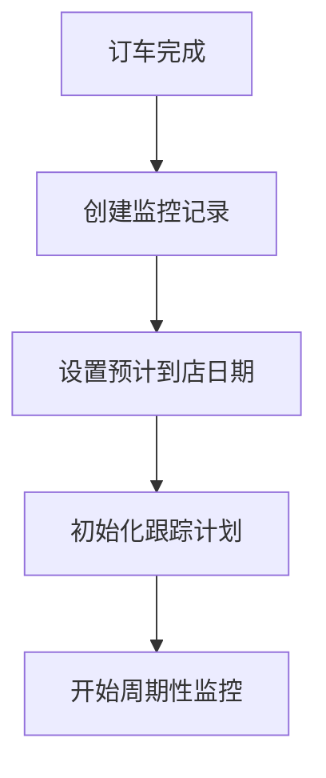
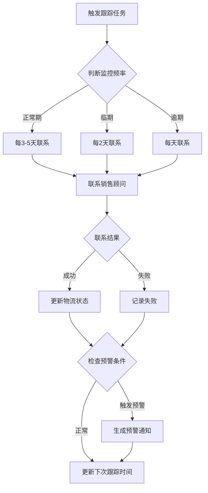
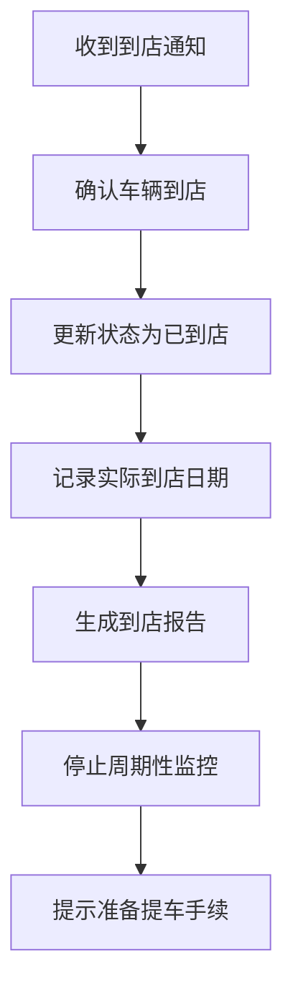

# 车辆到店情况监控功能设计文档

## 一、功能概述

在车辆未到店期间，系统通过定期联系销售顾问的方式，跟踪车辆物流状态，确保车辆按计划到货，及时发现并处理延期问题。

## 二、核心功能

### 2.1 监控周期设定
- **初始监控期**: 订车后开始监控
- **跟踪频率**:
  - 正常情况：每3-5天联系一次
  - 临期情况（预计到店前3-7天）：每2天联系一次
  - 逾期情况（超过预计到店日期）：每天联系一次

### 2.2 跟踪信息收集
每次联系销售顾问时，收集以下关键信息：
1. 车辆生产状态（已下单/生产中/已下线/已发车）
2. 物流状态（运输中/已到店/待提车）
3. 预计到店时间（精确到日期）
4. 物流单号/追踪信息
5. 是否有延期情况及延期原因
6. 特殊说明（如加急处理、特殊配置等待）

### 2.3 预警机制
- **延期预警**: 实际到店时间 > 预计到店时间 + 3天
- **信息缺失预警**: 连续2次无法联系上销售顾问
- **状态异常预警**: 超过预期周期未更新状态

### 2.4 提醒与通知
- 提前7天提醒：车辆即将到店
- 提前3天提醒：准备到店手续
- 到店当天：通知车辆已到店
- 延期通知：及时告知延期情况及原因

## 三、数据模型

### 3.1 车辆到店监控记录
```typescript
interface VehicleArrivalMonitor {
  // 基本信息
  id: string;
  goalId: string;                    // 关联的购车目标ID
  vehicleInfo: {
    brand: string;                    // 品牌
    model: string;                    // 型号
    vin?: string;                     // 车架号
    color?: string;                   // 颜色
    configuration?: string;           // 配置版本
  };

  // 销售顾问信息
  salesConsultant: {
    name: string;                     // 顾问姓名
    phone: string;                    // 联系电话
    wechat?: string;                  // 微信号
    dealership: string;               // 经销商名称
  };

  // 时间节点
  orderDate: Date;                    // 订车日期
  expectedArrivalDate: Date;          // 预计到店日期
  actualArrivalDate?: Date;           // 实际到店日期
  estimatedDeliveryDays?: number;     // 预计交付周期（天）

  // 监控状态
  status: 'active' | 'arrived' | 'cancelled' | 'delayed';
  currentVehicleStatus: 'ordered' | 'in_production' | 'shipped' | 'arrived' | 'picked_up';

  // 跟踪记录
  trackingRecords: TrackingRecord[];

  // 预警信息
  alerts: Alert[];

  // 元数据
  createdAt: Date;
  updatedAt: Date;
}

interface TrackingRecord {
  id: string;
  monitorId: string;
  contactDate: Date;
  contactMethod: 'phone' | 'wechat' | 'visit' | 'message';
  contactResult: 'success' | 'failed' | 'no_response';

  // 物流状态更新
  vehicleStatus: {
    productionStatus?: string;
    logisticsStatus?: string;
    estimatedArrivalDate?: Date;
    trackingNumber?: string;
    currentLocation?: string;
  };

  // 延期信息
  delayInfo?: {
    isDelayed: boolean;
    delayDays?: number;
    delayReason?: string;
    newExpectedDate?: Date;
  };

  // 备注
  notes?: string;

  createdAt: Date;
}

interface Alert {
  id: string;
  monitorId: string;
  type: 'delay' | 'missing_info' | 'abnormal_status' | 'reminder';
  level: 'info' | 'warning' | 'critical';
  title: string;
  message: string;
  isResolved: boolean;
  resolvedAt?: Date;
  createdAt: Date;
}
```

## 四、监控流程

### 4.1 监控启动


### 4.2 周期性跟踪


### 4.3 到店确认


## 五、用户交互设计

### 5.1 创建监控
```
用户: /goal add 我想买一辆丰田锋兰达，15-20万预算

[系统完成信息收集、计划生成...]

用户: /goal vehicle-arrival create
      订车日期: 2026-03-17
      预计到店: 2026-04-15
      销售顾问: 张三
      电话: 13800138000
      经销商: 丰田4S店(朝阳店)

系统: ✅ 已创建车辆到店监控

       📊 监控信息:
       - 车型: 丰田锋兰达
       - 订车日期: 2026-03-17
       - 预计到店: 2026-04-15 (预计29天)
       - 销售顾问: 张三 (13800138000)

       📅 跟踪计划:
       - 正常期: 每5天联系一次 (共5次)
       - 临期: 每2天联系一次 (4月8日起)
       - 到店提醒: 提前7天、3天、当天

       已自动创建跟踪任务，将定期提醒您联系销售顾问。
```

### 5.2 跟踪提醒
```
系统: 📬 【车辆到店跟踪提醒】今天是第1次跟踪日

       请联系销售顾问了解车辆状态：
       📞 张三: 13800138000

       需要确认的信息:
       1. 车辆生产状态
       2. 物流进度
       3. 预计到店时间是否有变化
       4. 物流单号

       [回复1] 已联系，更新信息
       [回复2] 暂时无法联系
       [回复3] 跳过本次
```

### 5.3 更新跟踪信息
```
用户: /goal vehicle-arrival update
      状态: 已发车
      预计到店: 2026-04-12 (提前3天)
      物流单号: SF1234567890
      当前位置: 途中-江苏段

系统: ✅ 已更新跟踪记录

       📊 最新状态:
       - 生产状态: ✅ 已发车
       - 物流状态: 运输中
       - 预计到店: 2026-04-12 (提前3天)
       - 物流单号: SF1234567890

       🎉 好消息！车辆将提前3天到店

       下次跟踪: 2026-04-09 (临期，每2天联系)
```

### 5.4 查看监控状态
```
用户: /goal vehicle-arrival status

系统: 📊 车辆到店监控状态

       🚗 车辆信息:
       - 车型: 丰田锋兰达
       - 订车日期: 2026-03-17
       - 预计到店: 2026-04-12
       - 剩余: 5天

       📍 当前状态: 运输中

       📋 跟踪记录 (3次):
       1. 2026-03-22 ✅ 生产中
       2. 2026-03-27 ✅ 已下线
       3. 2026-04-01 ✅ 已发车

       📅 下次跟踪: 2026-04-05

       🔔 预警提醒:
       - 4月5日: 提前7天提醒
       - 4月9日: 提前3天提醒
       - 4月12日: 到店提醒
```

### 5.5 到店确认
```
系统: 🎉 【车辆到店通知】您的车辆已到店！

       🚗 车辆信息:
       - 车型: 丰田锋兰达
       - VIN码: LTV123456789012345
       - 颜色: 珍珠白
       - 经销商: 丰田4S店(朝阳店)

       📋 提车准备清单:
       □ 身份证
       □ 驾驶证
       □ 订车合同/定金收据
       □ 购置税缴纳
       □ 保险办理
       □ 上牌资料

       📞 联系销售顾问预约提车:
       张三: 13800138000

       [回复1] 已预约提车时间
       [回复2] 查看提车清单详情
```

## 六、系统实现要点

### 6.1 任务调度
- 使用 `UnifiedTaskScheduler` 创建周期性跟踪任务
- 任务类型: `recurring` - 周期性执行
- 根据监控阶段动态调整执行频率

### 6.2 知识存储
- 每次跟踪结果存储到 `KnowledgeStore`
- 支持后续查询和历史记录分析
- 用于生成到店报告

### 6.3 智能通知
- 使用 `NotificationQueue` 管理跟踪提醒
- 根据 `ValueAssessor` 评估推送时机
- 到店前智能提前提醒

### 6.4 预警处理
- 延期预警生成 `critical` 级别通知
- 信息缺失预警生成 `warning` 级别通知
- 支持预警标记为已解决

## 七、数据持久化

```typescript
// 存储结构
~/.pi/agent/goal-driven/
├── vehicle-arrival/
│   ├── monitors.json              # 监控记录列表
│   ├── tracking-records/          # 跟踪记录
│   │   └── {monitorId}.jsonl
│   └── alerts.jsonl               # 预警记录
```

## 八、扩展功能

### 8.1 多车辆监控
支持同时监控多辆车的到店情况

### 8.2 物流追踪集成
集成快递/物流公司API，自动获取物流状态

### 8.3 数据分析
- 平均交付周期统计
- 经销商信誉评分
- 延期原因分析

### 8.4 智能建议
根据历史数据，提供订车时机建议

## 九、使用场景示例

### 场景1: 正常到店
```
订车 → 监控 → 5次跟踪 → 到店 → 提车
```

### 场景2: 延期处理
```
订车 → 监控 → 3次跟踪 → 发现延期 → 预警 → 协商 → 更新时间 → 到店
```

### 场景3: 提前到店
```
订车 → 监控 → 2次跟踪 → 发现生产加速 → 更新时间 → 提前到店
```

### 场景4: 信息缺失
```
订车 → 监控 → 联系失败 → 预警 → 尝试其他方式 → 获取信息 → 继续监控
```

## 十、总结

车辆到店情况监控功能通过：
1. **周期性跟踪**: 确保及时了解车辆状态
2. **智能预警**: 提前发现和处理延期问题
3. **友好提醒**: 到店前多阶段提醒
4. **完整记录**: 保存完整跟踪历史
5. **数据驱动**: 为未来购车决策提供参考

有效解决了购车等待期间的信息不对称问题，提升用户体验。

---

**文档版本**: v1.0
**更新日期**: 2026-03-17
**状态**: 设计完成，待实现
