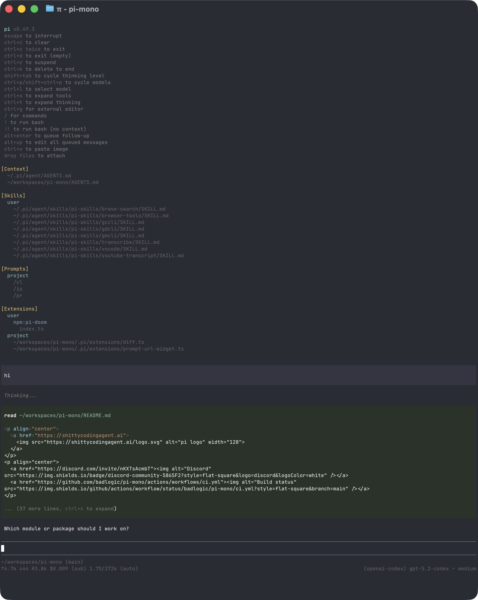

<p align="center">
  <a href="https://shittycodingagent.ai">
    
  </a>
</p>
<p align="center">
  <a href="https://discord.com/invite/3cU7Bz4UPx"></a>
  <a href="https://www.npmjs.com/package/@mariozechner/pi-coding-agent"></a>
  <a href="https://github.com/badlogic/pi-mono/actions/workflows/ci.yml"></a>
</p>
<p align="center">
  <a href="https://pi.dev">pi.dev</a> domain graciously donated by
  <br /><br />
  <a href="https://exe.dev"><br />exe.dev</a>
</p>

Pi is a minimal terminal coding harness. Adapt pi to your workflows, not the other way around, without having to fork and modify pi internals. Extend it with TypeScript [Extensions](#extensions), [Skills](#skills), [Prompt Templates](#prompt-templates), and [Themes](#themes). Put your extensions, skills, prompt templates, and themes in [Pi Packages](#pi-packages) and share them with others via npm or git.

Pi ships with powerful defaults but skips features like sub agents and plan mode. Instead, you can ask pi to build what you want or install a third party pi package that matches your workflow.

Pi runs in four modes: interactive, print or JSON, RPC for process integration, and an SDK for embedding in your own apps. See [openclaw/openclaw](https://github.com/openclaw/openclaw) for a real-world SDK integration.

## Table of Contents

- [Quick Start](#quick-start)
- [Providers & Models](#providers--models)
- [Interactive Mode](#interactive-mode)
  - [Editor](#editor)
  - [Commands](#commands)
  - [Keyboard Shortcuts](#keyboard-shortcuts)
  - [Message Queue](#message-queue)
- [Sessions](#sessions)
  - [Branching](#branching)
  - [Compaction](#compaction)
- [Settings](#settings)
- [Context Files](#context-files)
- [Customization](#customization)
  - [Prompt Templates](#prompt-templates)
  - [Skills](#skills)
  - [Extensions](#extensions)
  - [Goal-Driven Agent](#goal-driven-agent)
  - [Themes](#themes)
  - [Pi Packages](#pi-packages)
- [Programmatic Usage](#programmatic-usage)
- [Philosophy](#philosophy)
- [CLI Reference](#cli-reference)

---

## Quick Start

```bash
npm install -g @mariozechner/pi-coding-agent
```

Authenticate with an API key:

```bash
export ANTHROPIC_API_KEY=sk-ant-...
pi
```

Or use your existing subscription:

```bash
pi
/login  # Then select provider
```

Then just talk to pi. By default, pi gives the model four tools: `read`, `write`, `edit`, and `bash`. The model uses these to fulfill your requests. Add capabilities via [skills](#skills), [prompt templates](#prompt-templates), [extensions](#extensions), or [pi packages](#pi-packages).

**Platform notes:** [Windows](docs/windows.md) | [Termux (Android)](docs/termux.md) | [tmux](docs/tmux.md) | [Terminal setup](docs/terminal-setup.md) | [Shell aliases](docs/shell-aliases.md)

---

## Providers & Models

For each built-in provider, pi maintains a list of tool-capable models, updated with every release. Authenticate via subscription (`/login`) or API key, then select any model from that provider via `/model` (or Ctrl+L).

**Subscriptions:**
- Anthropic Claude Pro/Max
- OpenAI ChatGPT Plus/Pro (Codex)
- GitHub Copilot
- Google Gemini CLI
- Google Antigravity

**API keys:**
- Anthropic
- OpenAI
- Azure OpenAI
- Google Gemini
- Google Vertex
- Amazon Bedrock
- Mistral
- Groq
- Cerebras
- xAI
- OpenRouter
- Vercel AI Gateway
- ZAI
- OpenCode Zen
- OpenCode Go
- Hugging Face
- Kimi For Coding
- MiniMax

See [docs/providers.md](docs/providers.md) for detailed setup instructions.

**Custom providers & models:** Add providers via `~/.pi/agent/models.json` if they speak a supported API (OpenAI, Anthropic, Google). For custom APIs or OAuth, use extensions. See [docs/models.md](docs/models.md) and [docs/custom-provider.md](docs/custom-provider.md).

---

## Interactive Mode

<p align="center"></p>

The interface from top to bottom:

- **Startup header** - Shows shortcuts (`/hotkeys` for all), loaded AGENTS.md files, prompt templates, skills, and extensions
- **Messages** - Your messages, assistant responses, tool calls and results, notifications, errors, and extension UI
- **Editor** - Where you type; border color indicates thinking level
- **Footer** - Working directory, session name, total token/cache usage, cost, context usage, current model

The editor can be temporarily replaced by other UI, like built-in `/settings` or custom UI from extensions (e.g., a Q&A tool that lets the user answer model questions in a structured format). [Extensions](#extensions) can also replace the editor, add widgets above/below it, a status line, custom footer, or overlays.

### Editor

| Feature | How |
|---------|-----|
| File reference | Type `@` to fuzzy-search project files |
| Path completion | Tab to complete paths |
| Multi-line | Shift+Enter (or Ctrl+Enter on Windows Terminal) |
| Images | Ctrl+V to paste (Alt+V on Windows), or drag onto terminal |
| Bash commands | `!command` runs and sends output to LLM, `!!command` runs without sending |

Standard editing keybindings for delete word, undo, etc. See [docs/keybindings.md](docs/keybindings.md).

### Commands

Type `/` in the editor to trigger commands. [Extensions](#extensions) can register custom commands, [skills](#skills) are available as `/skill:name`, and [prompt templates](#prompt-templates) expand via `/templatename`.

| Command | Description |
|---------|-------------|
| `/login`, `/logout` | OAuth authentication |
| `/model` | Switch models |
| `/scoped-models` | Enable/disable models for Ctrl+P cycling |
| `/settings` | Thinking level, theme, message delivery, transport |
| `/resume` | Pick from previous sessions |
| `/new` | Start a new session |
| `/name <name>` | Set session display name |
| `/session` | Show session info (path, tokens, cost) |
| `/tree` | Jump to any point in the session and continue from there |
| `/fork` | Create a new session from the current branch |
| `/compact [prompt]` | Manually compact context, optional custom instructions |
| `/copy` | Copy last assistant message to clipboard |
| `/export [file]` | Export session to HTML file |
| `/share` | Upload as private GitHub gist with shareable HTML link |
| `/reload` | Reload extensions, skills, prompts, context files (themes hot-reload automatically) |
| `/hotkeys` | Show all keyboard shortcuts |
| `/changelog` | Display version history |
| `/quit`, `/exit` | Quit pi |

### Keyboard Shortcuts

See `/hotkeys` for the full list. Customize via `~/.pi/agent/keybindings.json`. See [docs/keybindings.md](docs/keybindings.md).

**Commonly used:**

| Key | Action |
|-----|--------|
| Ctrl+C | Clear editor |
| Ctrl+C twice | Quit |
| Escape | Cancel/abort |
| Escape twice | Open `/tree` |
| Ctrl+L | Open model selector |
| Ctrl+P / Shift+Ctrl+P | Cycle scoped models forward/backward |
| Shift+Tab | Cycle thinking level |
| Ctrl+O | Collapse/expand tool output |
| Ctrl+T | Collapse/expand thinking blocks |

### Message Queue

Submit messages while the agent is working:

- **Enter** queues a *steering* message, delivered after current tool execution (interrupts remaining tools)
- **Alt+Enter** queues a *follow-up* message, delivered only after the agent finishes all work
- **Escape** aborts and restores queued messages to editor
- **Alt+Up** retrieves queued messages back to editor

On Windows Terminal, `Alt+Enter` is fullscreen by default. Remap it in [docs/terminal-setup.md](docs/terminal-setup.md) so pi can receive the follow-up shortcut.

Configure delivery in [settings](docs/settings.md): `steeringMode` and `followUpMode` can be `"one-at-a-time"` (default, waits for response) or `"all"` (delivers all queued at once). `transport` selects provider transport preference (`"sse"`, `"websocket"`, or `"auto"`) for providers that support multiple transports.

---

## Sessions

Sessions are stored as JSONL files with a tree structure. Each entry has an `id` and `parentId`, enabling in-place branching without creating new files. See [docs/session.md](docs/session.md) for file format.

### Management

Sessions auto-save to `~/.pi/agent/sessions/` organized by working directory.

```bash
pi -c                  # Continue most recent session
pi -r                  # Browse and select from past sessions
pi --no-session        # Ephemeral mode (don't save)
pi --session <path>    # Use specific session file or ID
```

### Branching

**`/tree`** - Navigate the session tree in-place. Select any previous point, continue from there, and switch between branches. All history preserved in a single file.

<p align="center"></p>

- Search by typing, fold/unfold and jump between branches with Ctrl+←/Ctrl+→ or Alt+←/Alt+→, page with ←/→
- Filter modes (Ctrl+O): default → no-tools → user-only → labeled-only → all
- Press `l` to label entries as bookmarks

**`/fork`** - Create a new session file from the current branch. Opens a selector, copies history up to the selected point, and places that message in the editor for modification.

### Compaction

Long sessions can exhaust context windows. Compaction summarizes older messages while keeping recent ones.

**Manual:** `/compact` or `/compact <custom instructions>`

**Automatic:** Enabled by default. Triggers on context overflow (recovers and retries) or when approaching the limit (proactive). Configure via `/settings` or `settings.json`.

Compaction is lossy. The full history remains in the JSONL file; use `/tree` to revisit. Customize compaction behavior via [extensions](#extensions). See [docs/compaction.md](docs/compaction.md) for internals.

---

## Settings

Use `/settings` to modify common options, or edit JSON files directly:

| Location | Scope |
|----------|-------|
| `~/.pi/agent/settings.json` | Global (all projects) |
| `.pi/settings.json` | Project (overrides global) |

See [docs/settings.md](docs/settings.md) for all options.

---

## Context Files

Pi loads `AGENTS.md` (or `CLAUDE.md`) at startup from:
- `~/.pi/agent/AGENTS.md` (global)
- Parent directories (walking up from cwd)
- Current directory

Use for project instructions, conventions, common commands. All matching files are concatenated.

### System Prompt

Replace the default system prompt with `.pi/SYSTEM.md` (project) or `~/.pi/agent/SYSTEM.md` (global). Append without replacing via `APPEND_SYSTEM.md`.

---

## Customization

### Prompt Templates

Reusable prompts as Markdown files. Type `/name` to expand.

```markdown
<!-- ~/.pi/agent/prompts/review.md -->
Review this code for bugs, security issues, and performance problems.
Focus on: {{focus}}
```

Place in `~/.pi/agent/prompts/`, `.pi/prompts/`, or a [pi package](#pi-packages) to share with others. See [docs/prompt-templates.md](docs/prompt-templates.md).

### Skills

On-demand capability packages following the [Agent Skills standard](https://agentskills.io). Invoke via `/skill:name` or let the agent load them automatically.

```markdown
<!-- ~/.pi/agent/skills/my-skill/SKILL.md -->
# My Skill
Use this skill when the user asks about X.

## Steps
1. Do this
2. Then that
```

Place in `~/.pi/agent/skills/`, `~/.agents/skills/`, `.pi/skills/`, or `.agents/skills/` (from `cwd` up through parent directories) or a [pi package](#pi-packages) to share with others. See [docs/skills.md](docs/skills.md).

### Extensions

<p align="center"></p>

TypeScript modules that extend pi with custom tools, commands, keyboard shortcuts, event handlers, and UI components.

```typescript
export default function (pi: ExtensionAPI) {
  pi.registerTool({ name: "deploy", ... });
  pi.registerCommand("stats", { ... });
  pi.on("tool_call", async (event, ctx) => { ... });
}
```

**What's possible:**
- Custom tools (or replace built-in tools entirely)
- Sub-agents and plan mode
- Custom compaction and summarization
- Permission gates and path protection
- Custom editors and UI components
- Status lines, headers, footers
- Git checkpointing and auto-commit
- SSH and sandbox execution
- MCP server integration
- Make pi look like Claude Code
- Games while waiting (yes, Doom runs)
- ...anything you can dream up

Place in `~/.pi/agent/extensions/`, `.pi/extensions/`, or a [pi package](#pi-packages) to share with others. See [docs/extensions.md](docs/extensions.md) and [examples/extensions/](examples/extensions/).

### Goal-Driven Agent

Goal-Driven Agent 是 Pi 的一个强大扩展，实现自主目标管理和后台任务执行。它允许用户定义长期目标，自动分解为子目标和任务，并在后台智能调度执行。

#### 核心概念

##### 目标 (Goal)

目标是用户想要达成的长期事项。每个目标包含：
- **维度 (Dimensions)** - 探索空间定义
- **成功标准 (SuccessCriteria)** - 如何判断目标已完成
- **进度 (Progress)** - 完成百分比

##### 子目标 (SubGoal)

将大目标分解为可管理的阶段性目标：
- 支持依赖关系（前置子目标）
- 权重系统（影响进度计算）
- 状态流转：pending → ready → in_progress → completed

##### 任务 (Task)

具体的执行单元，支持 6 种类型：

| 类型 | 用途 | 示例 |
|------|------|------|
| `exploration` | 信息收集 | 搜索雅思备考资料 |
| `one_time` | 一次性执行 | 创建学习计划 |
| `recurring` | 周期性执行 | 每日学习提醒 |
| `interactive` | 需要用户输入 | 询问学习偏好 |
| `monitoring` | 持续监控 | 监控考试报名开放 |
| `event_triggered` | 事件触发 | 考试日期临近提醒 |

任务状态流转：
```
pending → blocked → ready → in_progress → completed
              ↑         ↓
              └─────────┘ (依赖满足时)

in_progress → waiting_user → ready → completed
               (交互式任务)
```

##### 知识库 (Knowledge Store)

自动提取和存储任务执行中的关键信息：
- 基于目标范围的知识检索
- 支持关键词搜索和相似度计算
- 在后续任务的 Prompt 中注入相关背景知识

#### 架构概览

```
┌─────────────────────────────────────────────────────────────┐
│                    Goal-Driven Extension                     │
├─────────────────────────────────────────────────────────────┤
│  GoalOrchestrator (10阶段工作流编排)                          │
│    ├── ContextGatherer (信息收集)                             │
│    ├── SubGoalPlanner (子目标拆解)                            │
│    ├── TaskPlanner (任务生成)                                 │
│    └── SuccessCriteriaChecker (成功标准检查)                  │
├─────────────────────────────────────────────────────────────┤
│  UnifiedTaskScheduler (统一任务调度)                          │
│    ├── TaskStore / GoalStore / SubGoalStore (存储层)         │
│    ├── KnowledgeStore (知识存储)                              │
│    ├── TaskDependencyGraph (依赖管理)                         │
│    └── ValueAssessor (价值评估)                               │
├─────────────────────────────────────────────────────────────┤
│  AgentPiBackgroundExecutor (后台执行)                         │
│    ├── BackgroundSessionManager (会话管理)                    │
│    └── ToolProvider (工具提供)                                │
└─────────────────────────────────────────────────────────────┘
```

#### 快速开始

##### 创建目标

```bash
# 在 Pi 中使用命令
/goal add 准备雅思考试，目标分数7分

# 或使用 API
const goalStore = new GoalStore();
const goal = await goalStore.createGoal({
  title: '准备雅思考试',
  description: '3个月内通过雅思考试',
  status: 'active',
  priority: 'high',
  successCriteria: [
    { description: '完成备考书籍', type: 'deliverable' },
    { description: '模拟考达到7分', type: 'condition' },
  ],
});
```

##### 启动调度器

```typescript
const scheduler = new UnifiedTaskScheduler(
  taskStore, goalStore, knowledgeStore, ...
);

await scheduler.start();
```

#### 工作流程

Goal-Driven Agent 采用 10 阶段工作流：

```
1. 信息收集 → 收集用户背景和偏好
2. 子目标拆解 → 将目标分解为阶段性目标
3. 任务生成 → 为每个子目标创建具体任务
4. 计划确认 → 用户审查并确认计划
5. 执行调度 → 按优先级和依赖调度任务
6. 后台执行 → 独立会话中执行任务
7. 知识提取 → 自动提取关键发现
8. 价值评估 → 评估任务输出价值
9. 进度更新 → 更新目标和子目标进度
10. Review → 检查成功标准，判断完成
```

#### Prompt 构建机制

每个任务执行时构建三层 Prompt：

| 层级 | 名称 | 来源 | 内容 |
|------|------|------|------|
| L1 | System Prompt | `buildDefaultSystemPrompt()` | Agent 角色定义、输出格式 |
| L2 | Knowledge Context | 知识库检索 | 历史知识、上下文 |
| L3 | Agent Prompt | `task.execution.agentPrompt` | 具体任务内容 |

**System Prompt 示例**：
```
You are an autonomous task execution agent running in background mode.

## 输出格式要求

完成任务后，请在回复末尾使用以下格式标记关键发现：

\`\`\`key_findings
- [关键发现1：简洁描述最重要的发现]
- [关键发现2：次要发现或数据]
\`\`\`
```

**User Prompt 构建**：
```typescript
// agent-pi-executor.ts: buildEnhancedPrompt()
const parts = [];

// 知识上下文（可选）
if (knowledgeEntries?.length > 0) {
  parts.push(`## 相关背景知识`);
  parts.push(knowledgeEntries.map(k => `- [${k.category}] ${k.content}`));
}

// 任务内容（必选）
parts.push(`## 任务`);
parts.push(task.execution.agentPrompt);

// 输出要求
parts.push(`## 输出要求`);
parts.push(`请完成以上任务，并提供清晰、结构化的结果。`);
```

#### 知识提取

任务完成后自动提取知识：

| 来源 | 优先级 | 数量 | importance |
|------|--------|------|------------|
| `key_findings` 代码块 | 高 | 最多 3 条 | 0.9 |
| 末尾段落自动提取 | 低 | 最多 2 条 | 0.7 |

**触发时机**：每次任务成功后必定调用 `extractKnowledgeFromOutput()`

**提取逻辑**：
```typescript
// 1. 优先检测 key_findings 代码块
if (output.match(/```key_findings\n([\s\S]*?)```/)) {
  return 提取的 key_findings;
}

// 2. 回退：提取末尾段落
return extractFromEndParagraphs(output);
```

#### 通知系统

任务完成后发送结构化通知：

```
## ✅ 搜索备考资料 - 执行完成

**子目标**: 第1个子目标 - 资料收集
**任务类型**: 信息收集 | **优先级**: high

## 📤 执行结果
...

## 📁 输出文件
- `/Users/xxx/ielts_study_plan.md`

---

📈 价值评估
- 相关度: 95%
- 新颖度: 80%
- 可操作性: 90%
- **总体评分**: 88/100
```

#### 命令参考

| 命令 | 描述 |
|------|------|
| `/goal add <desc>` | 创建新目标 |
| `/goal list` | 列出所有目标 |
| `/goal status` | 显示调度器状态 |
| `/goal tasks` | 显示任务队列 |
| `/goal info <id>` | 显示目标详情 |
| `/goal stop` | 停止调度器 |
| `/goal resume` | 恢复调度器 |
| `/goal complete <id>` | 标记目标完成 |
| `/goal abandon <id>` | 放弃目标 |
| `/goal clear --confirm` | 清除所有数据 |
| `/goal clear-logs` | 清除日志文件 |

#### 快捷键

| 快捷键 | 功能 |
|--------|------|
| `Alt+B` | 进入后台日志视图 |
| `Ctrl+C` | 停止日志跟踪（在日志视图中） |
| `q` | 退出日志视图 |

#### 配置

配置文件位置：`~/.pi/agent/goal-driven/config.json`

```json
{
  "maxConcurrentTasks": 3,
  "schedulerCycleIntervalMs": 60000,
  "taskDefaultTimeoutMs": 600000,
  "taskHeartbeatTimeoutMs": 120000,
  "llmLogMode": "standard",
  "uiLogLevel": "info"
}
```

#### 存储结构

```
~/.pi/agent/goal-driven/
├── goals/
│   └── goals.json              # 目标定义
├── tasks/
│   └── {goalId}/
│       └── tasks.json          # 任务列表
├── sub-goals/
│   └── sub-goals.json          # 子目标定义
├── knowledge/
│   └── global.jsonl            # 知识条目（追加式）
├── config.json                 # 配置文件
└── logs/
    └── goal-driven-{date}.log  # 日志文件
```

#### API 参考

详细 API 文档见项目 [CLAUDE.md](./CLAUDE.md)。

主要接口：
- `TaskStore` - 任务 CRUD、状态管理
- `GoalStore` - 目标和维度管理
- `SubGoalStore` - 子目标生命周期
- `KnowledgeStore` - 知识存储和检索
- `UnifiedTaskScheduler` - 任务调度
- `GoalOrchestrator` - 工作流编排

### Themes

Built-in: `dark`, `light`. Themes hot-reload: modify the active theme file and pi immediately applies changes.

Place in `~/.pi/agent/themes/`, `.pi/themes/`, or a [pi package](#pi-packages) to share with others. See [docs/themes.md](docs/themes.md).

### Pi Packages

Bundle and share extensions, skills, prompts, and themes via npm or git. Find packages on [npmjs.com](https://www.npmjs.com/search?q=keywords%3Api-package) or [Discord](https://discord.com/channels/1456806362351669492/1457744485428629628).

> **Security:** Pi packages run with full system access. Extensions execute arbitrary code, and skills can instruct the model to perform any action including running executables. Review source code before installing third-party packages.

```bash
pi install npm:@foo/pi-tools
pi install npm:@foo/pi-tools@1.2.3      # pinned version
pi install git:github.com/user/repo
pi install git:github.com/user/repo@v1  # tag or commit
pi install git:git@github.com:user/repo
pi install git:git@github.com:user/repo@v1  # tag or commit
pi install https://github.com/user/repo
pi install https://github.com/user/repo@v1      # tag or commit
pi install ssh://git@github.com/user/repo
pi install ssh://git@github.com/user/repo@v1    # tag or commit
pi remove npm:@foo/pi-tools
pi uninstall npm:@foo/pi-tools          # alias for remove
pi list
pi update                               # skips pinned packages
pi config                               # enable/disable extensions, skills, prompts, themes
```

Packages install to `~/.pi/agent/git/` (git) or global npm. Use `-l` for project-local installs (`.pi/git/`, `.pi/npm/`). If you use a Node version manager and want package installs to reuse a stable npm context, set `npmCommand` in `settings.json`, for example `["mise", "exec", "node@20", "--", "npm"]`.

Create a package by adding a `pi` key to `package.json`:

```json
{
  "name": "my-pi-package",
  "keywords": ["pi-package"],
  "pi": {
    "extensions": ["./extensions"],
    "skills": ["./skills"],
    "prompts": ["./prompts"],
    "themes": ["./themes"]
  }
}
```

Without a `pi` manifest, pi auto-discovers from conventional directories (`extensions/`, `skills/`, `prompts/`, `themes/`).

See [docs/packages.md](docs/packages.md).

---

## Programmatic Usage

### SDK

```typescript
import { AuthStorage, createAgentSession, ModelRegistry, SessionManager } from "@mariozechner/pi-coding-agent";

const { session } = await createAgentSession({
  sessionManager: SessionManager.inMemory(),
  authStorage: AuthStorage.create(),
  modelRegistry: new ModelRegistry(authStorage),
});

await session.prompt("What files are in the current directory?");
```

See [docs/sdk.md](docs/sdk.md) and [examples/sdk/](examples/sdk/).

### RPC Mode

For non-Node.js integrations, use RPC mode over stdin/stdout:

```bash
pi --mode rpc
```

RPC mode uses strict LF-delimited JSONL framing. Clients must split records on `\n` only. Do not use generic line readers like Node `readline`, which also split on Unicode separators inside JSON payloads.

See [docs/rpc.md](docs/rpc.md) for the protocol.

---

## Philosophy

Pi is aggressively extensible so it doesn't have to dictate your workflow. Features that other tools bake in can be built with [extensions](#extensions), [skills](#skills), or installed from third-party [pi packages](#pi-packages). This keeps the core minimal while letting you shape pi to fit how you work.

**No MCP.** Build CLI tools with READMEs (see [Skills](#skills)), or build an extension that adds MCP support. [Why?](https://mariozechner.at/posts/2025-11-02-what-if-you-dont-need-mcp/)

**No sub-agents.** There's many ways to do this. Spawn pi instances via tmux, or build your own with [extensions](#extensions), or install a package that does it your way.

**No permission popups.** Run in a container, or build your own confirmation flow with [extensions](#extensions) inline with your environment and security requirements.

**No plan mode.** Write plans to files, or build it with [extensions](#extensions), or install a package.

**No built-in to-dos.** They confuse models. Use a TODO.md file, or build your own with [extensions](#extensions).

**No background bash.** Use tmux. Full observability, direct interaction.

Read the [blog post](https://mariozechner.at/posts/2025-11-30-pi-coding-agent/) for the full rationale.

---

## CLI Reference

```bash
pi [options] [@files...] [messages...]
```

### Package Commands

```bash
pi install <source> [-l]     # Install package, -l for project-local
pi remove <source> [-l]      # Remove package
pi uninstall <source> [-l]   # Alias for remove
pi update [source]           # Update packages (skips pinned)
pi list                      # List installed packages
pi config                    # Enable/disable package resources
```

### Modes

| Flag | Description |
|------|-------------|
| (default) | Interactive mode |
| `-p`, `--print` | Print response and exit |
| `--mode json` | Output all events as JSON lines (see [docs/json.md](docs/json.md)) |
| `--mode rpc` | RPC mode for process integration (see [docs/rpc.md](docs/rpc.md)) |
| `--export <in> [out]` | Export session to HTML |

### Model Options

| Option | Description |
|--------|-------------|
| `--provider <name>` | Provider (anthropic, openai, google, etc.) |
| `--model <pattern>` | Model pattern or ID (supports `provider/id` and optional `:<thinking>`) |
| `--api-key <key>` | API key (overrides env vars) |
| `--thinking <level>` | `off`, `minimal`, `low`, `medium`, `high`, `xhigh` |
| `--models <patterns>` | Comma-separated patterns for Ctrl+P cycling |
| `--list-models [search]` | List available models |

### Session Options

| Option | Description |
|--------|-------------|
| `-c`, `--continue` | Continue most recent session |
| `-r`, `--resume` | Browse and select session |
| `--session <path>` | Use specific session file or partial UUID |
| `--session-dir <dir>` | Custom session storage directory |
| `--no-session` | Ephemeral mode (don't save) |

### Tool Options

| Option | Description |
|--------|-------------|
| `--tools <list>` | Enable specific built-in tools (default: `read,bash,edit,write`) |
| `--no-tools` | Disable all built-in tools (extension tools still work) |

Available built-in tools: `read`, `bash`, `edit`, `write`, `grep`, `find`, `ls`

### Resource Options

| Option | Description |
|--------|-------------|
| `-e`, `--extension <source>` | Load extension from path, npm, or git (repeatable) |
| `--no-extensions` | Disable extension discovery |
| `--skill <path>` | Load skill (repeatable) |
| `--no-skills` | Disable skill discovery |
| `--prompt-template <path>` | Load prompt template (repeatable) |
| `--no-prompt-templates` | Disable prompt template discovery |
| `--theme <path>` | Load theme (repeatable) |
| `--no-themes` | Disable theme discovery |

Combine `--no-*` with explicit flags to load exactly what you need, ignoring settings.json (e.g., `--no-extensions -e ./my-ext.ts`).

### Other Options

| Option | Description |
|--------|-------------|
| `--system-prompt <text>` | Replace default prompt (context files and skills still appended) |
| `--append-system-prompt <text>` | Append to system prompt |
| `--verbose` | Force verbose startup |
| `-h`, `--help` | Show help |
| `-v`, `--version` | Show version |

### File Arguments

Prefix files with `@` to include in the message:

```bash
pi @prompt.md "Answer this"
pi -p @screenshot.png "What's in this image?"
pi @code.ts @test.ts "Review these files"
```

### Examples

```bash
# Interactive with initial prompt
pi "List all .ts files in src/"

# Non-interactive
pi -p "Summarize this codebase"

# Different model
pi --provider openai --model gpt-4o "Help me refactor"

# Model with provider prefix (no --provider needed)
pi --model openai/gpt-4o "Help me refactor"

# Model with thinking level shorthand
pi --model sonnet:high "Solve this complex problem"

# Limit model cycling
pi --models "claude-*,gpt-4o"

# Read-only mode
pi --tools read,grep,find,ls -p "Review the code"

# High thinking level
pi --thinking high "Solve this complex problem"
```

### Environment Variables

| Variable | Description |
|----------|-------------|
| `PI_CODING_AGENT_DIR` | Override config directory (default: `~/.pi/agent`) |
| `PI_PACKAGE_DIR` | Override package directory (useful for Nix/Guix where store paths tokenize poorly) |
| `PI_SKIP_VERSION_CHECK` | Skip version check at startup |
| `PI_CACHE_RETENTION` | Set to `long` for extended prompt cache (Anthropic: 1h, OpenAI: 24h) |
| `VISUAL`, `EDITOR` | External editor for Ctrl+G |

---

## Contributing & Development

See [CONTRIBUTING.md](../../CONTRIBUTING.md) for guidelines and [docs/development.md](docs/development.md) for setup, forking, and debugging.

---

## License

MIT

## See Also

- [@mariozechner/pi-ai](https://www.npmjs.com/package/@mariozechner/pi-ai): Core LLM toolkit
- [@mariozechner/pi-agent](https://www.npmjs.com/package/@mariozechner/pi-agent): Agent framework
- [@mariozechner/pi-tui](https://www.npmjs.com/package/@mariozechner/pi-tui): Terminal UI components
